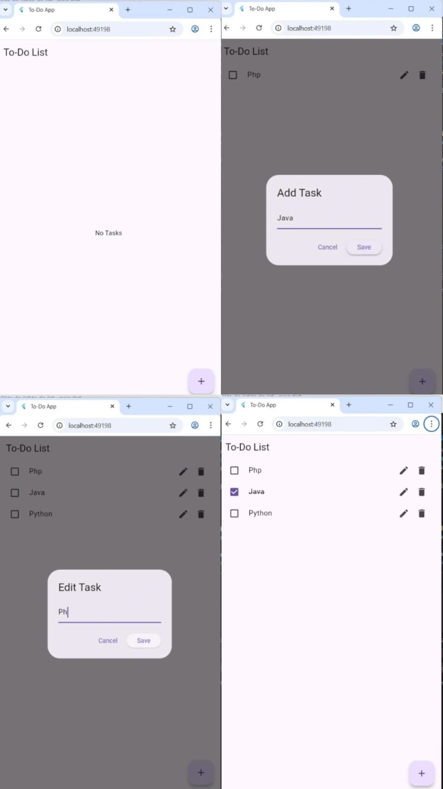

# To-Do List App (Flutter)

This is a simple To-Do List application built using Flutter.

## Features
- Add new tasks
- Edit tasks
- Delete tasks
- Mark tasks as completed
- Data stored locally using SharedPreferences

## Technologies Used
- Flutter
- Dart
- SharedPreferences

## Author
Vanshika Jaiswal
## App Screenshot

